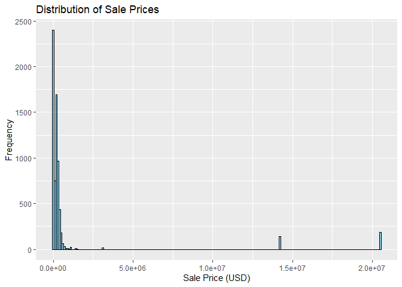
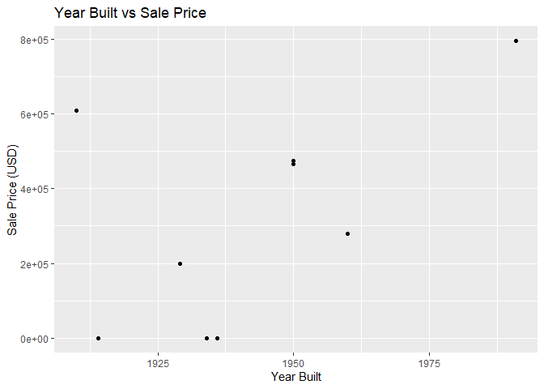

<!-- README.md is generated from README.Rmd. Please edit the README.Rmd file -->

# Lab report \#2

``` r
library(remotes)
remotes::install_github("heike/classdata")
```

    ## Skipping install of 'classdata' from a github remote, the SHA1 (1faa8961) has not changed since last install.
    ##   Use `force = TRUE` to force installation

``` r
library(classdata)
```

# Summary of Finding:

There is a total of 16 variables, with Sale Price being the main
variable. It seems there is a positive correlation between Sale Price
with Total Living Area and Year Built. There are outliers which we can
deduce is a anomaly of luxuriousness. People tend to settle with buying
places with 2-4 bedrooms.

# Question 1: Inspect the first few lines of the data set

``` r
?ames 
```

    ## starting httpd help server ... done

``` r
colnames(ames)
```

    ##  [1] "Parcel ID"             "Address"               "Style"                
    ##  [4] "Occupancy"             "Sale Date"             "Sale Price"           
    ##  [7] "Multi Sale"            "YearBuilt"             "Acres"                
    ## [10] "TotalLivingArea (sf)"  "Bedrooms"              "FinishedBsmtArea (sf)"
    ## [13] "LotArea(sf)"           "AC"                    "FirePlace"            
    ## [16] "Neighborhood"

``` r
head(ames)
```

    ##    Parcel ID                       Address             Style
    ## 1 0903202160      1024 RIDGEWOOD AVE, AMES 1 1/2 Story Frame
    ## 2 0907428215 4503 TWAIN CIR UNIT 105, AMES     1 Story Frame
    ## 3 0909428070        2030 MCCARTHY RD, AMES     1 Story Frame
    ## 4 0923203160         3404 EMERALD DR, AMES     1 Story Frame
    ## 5 0520440010       4507 EVEREST  AVE, AMES              <NA>
    ## 6 0907275030       4512 HEMINGWAY DR, AMES     2 Story Frame
    ##                        Occupancy  Sale Date Sale Price Multi Sale YearBuilt
    ## 1 Single-Family / Owner Occupied 2022-08-12     181900       <NA>      1940
    ## 2                    Condominium 2022-08-04     127100       <NA>      2006
    ## 3 Single-Family / Owner Occupied 2022-08-15          0       <NA>      1951
    ## 4                      Townhouse 2022-08-09     245000       <NA>      1997
    ## 5                           <NA> 2022-08-03     449664       <NA>        NA
    ## 6 Single-Family / Owner Occupied 2022-08-16     368000       <NA>      1996
    ##   Acres TotalLivingArea (sf) Bedrooms FinishedBsmtArea (sf) LotArea(sf)  AC
    ## 1 0.109                 1030        2                    NA        4740 Yes
    ## 2 0.027                  771        1                    NA        1181 Yes
    ## 3 0.321                 1456        3                  1261       14000 Yes
    ## 4 0.103                 1289        4                   890        4500 Yes
    ## 5 0.287                   NA       NA                    NA       12493  No
    ## 6 0.494                 2223        4                    NA       21533 Yes
    ##   FirePlace              Neighborhood
    ## 1       Yes       (28) Res: Brookside
    ## 2        No    (55) Res: Dakota Ridge
    ## 3        No        (32) Res: Crawford
    ## 4        No        (31) Res: Mitchell
    ## 5        No (19) Res: North Ridge Hei
    ## 6       Yes   (37) Res: College Creek

``` r
str(ames)
```

    ## Classes 'tbl_df', 'tbl' and 'data.frame':    6935 obs. of  16 variables:
    ##  $ Parcel ID            : chr  "0903202160" "0907428215" "0909428070" "0923203160" ...
    ##  $ Address              : chr  "1024 RIDGEWOOD AVE, AMES" "4503 TWAIN CIR UNIT 105, AMES" "2030 MCCARTHY RD, AMES" "3404 EMERALD DR, AMES" ...
    ##  $ Style                : Factor w/ 12 levels "1 1/2 Story Brick",..: 2 5 5 5 NA 9 5 5 5 5 ...
    ##  $ Occupancy            : Factor w/ 5 levels "Condominium",..: 2 1 2 3 NA 2 2 1 2 2 ...
    ##  $ Sale Date            : Date, format: "2022-08-12" "2022-08-04" ...
    ##  $ Sale Price           : num  181900 127100 0 245000 449664 ...
    ##  $ Multi Sale           : chr  NA NA NA NA ...
    ##  $ YearBuilt            : num  1940 2006 1951 1997 NA ...
    ##  $ Acres                : num  0.109 0.027 0.321 0.103 0.287 0.494 0.172 0.023 0.285 0.172 ...
    ##  $ TotalLivingArea (sf) : num  1030 771 1456 1289 NA ...
    ##  $ Bedrooms             : num  2 1 3 4 NA 4 5 1 3 4 ...
    ##  $ FinishedBsmtArea (sf): num  NA NA 1261 890 NA ...
    ##  $ LotArea(sf)          : num  4740 1181 14000 4500 12493 ...
    ##  $ AC                   : chr  "Yes" "Yes" "Yes" "Yes" ...
    ##  $ FirePlace            : chr  "Yes" "No" "No" "No" ...
    ##  $ Neighborhood         : Factor w/ 42 levels "(0) None","(13) Apts: Campus",..: 15 40 19 18 6 24 14 40 13 23 ...

``` r
summary(ames$AC)
```

    ##    Length     Class      Mode 
    ##      6935 character character

**Parcel ID**:  
Format: Character  
Description: Unique identifier for each property  
Expected Data Range: Unique IDs, length of characters varies  

**Address**:  
Format: Character  
Description: Property address in Ames, IA  
Expected Data Range: Various addresses in Ames, IA  

**Style**:  
Format: Factor  
Description: Type of housing, such as “Colonial,” “Ranch,”
“Split-Level,” etc.  
Expected Data Range: Different housing styles as factor with 12 levels  

**Occupancy**:  
Format: Factor  
Description: Type of occupancy, indicating whether the property is
occupied or not  
Expected Data Range: Occupancy status as factor with 5 levels  

**Sale Date**:  
Format: Date  
Description: Date of the property sale  
Expected Data Range: Dates ranging from 2017-07-03 to 2022-08-31  

**Sale Price**:  
Format: Numeric (in US dollars)  
Description: Sales price of the property  
Expected Data Range: Sale prices in US dollars, varying from 0 to
20500000  

**Multi Sale**:  
Format: Character (logical- boolean)  
Description: Indicates if the sale was part of a package or multiple
sale  
Expected Data Range: Y/N  

**YearBuilt**:  
Format: Numeric (integer)  
Description: Year in which the house was built  
Expected Data Range: Years ranging from 0 to 2022  

**Acres**:  
Format: Numeric  
Description: Size of the lot in acres  
Expected Data Range: Acres of the lots, ranging from 0 to 12.0120  

**TotalLivingArea (sf)**:  
Format: Numeric (Square Feet)  
Description: Total living area of the property in square feet  
Expected Data Range: Living area sizes in square feet, varying from 0 to
6007  

**Bedrooms**:  
Format: Numeric  
Description: Number of bedrooms in the property  
Expected Data Range: Number of bedrooms, ranging from 0 to 10  

**FinishedBsmtArea (sf)**:  
Format: Numeric (Square Feet)  
Description: Total area of the finished basement in square feet  
Expected Data Range: Sizes of finished basement areas in square feet,
ranging from 10 to 6496  

**LotArea(sf)**:  
Format: Numeric (Square Feet)  
Description: Total area of the lot in square feet  
Expected Data Range: Lot areas in square feet, ranging from 0 to
523228  

**AC**:  
Format: Character (logical- boolean)  
Description: Indicates if the property has air conditioning  
Expected Data Range: Yes/No  

**FirePlace**:  
Format: Character (logical- boolean) Description: Indicates if the
property has a fireplace  
Expected Data Range: Yes/No  

**Neighborhood**:  
Format: Factor  
Description: Neighborhood area in Ames  
Expected Data Range: Different neighborhood names as factor with 42
levels  

# Question 2: Is there a variable of special interest or focus?

Sale Price is the main variable of interest. It is a numerical variable
that can help determine which other key variables contribute to the
pricing of residential properties in Ames.

# Question 3: Start the exploration with the main variable

``` r
# Range 
summary(ames$`Sale Price`)
```

    ##     Min.  1st Qu.   Median     Mean  3rd Qu.     Max. 
    ##        0        0   170900  1017479   280000 20500000

``` r
# NA values 
sum(is.na(ames$`Sale Price`))
```

    ## [1] 0

``` r
# Extreme values 
sum(ames$`Sale Price` > 1000000, na.rm = TRUE)
```

    ## [1] 394

``` r
# Distribution 
library(ggplot2)

ggplot(ames, aes(x = `Sale Price`)) +
  geom_histogram(binwidth = 100000, fill = 'skyblue', color = 'black') +
  labs(title = "Distribution of Sale Prices",
       x = "Sale Price (USD)",
       y = "Frequency")
```

<!-- -->

**Main Variable:** Sale Price  
Range: 0 to \$20,500,000  
General pattern: Skewed right  Oddities: No NA values but does have a
few extreme values and looking at the histogram you can see a few
outliers  

# Question 4: Pick a variable that might be related to the main variable Sale Price

**Variable Chosen:** Year Built TotalLivingArea  

``` r
# Range 
summary(ames$YearBuilt)
```

    ##    Min. 1st Qu.  Median    Mean 3rd Qu.    Max.    NA's 
    ##       0    1956    1978    1976    2002    2022     447

``` r
# NA values 
sum(is.na(ames$YearBuilt))
```

    ## [1] 447

``` r
# Extreme values 
sum(ames$YearBuilt < 1850, na.rm = TRUE)
```

    ## [1] 1

``` r
# Distribution
a <- na.omit(ames)
ggplot(a, aes(x = YearBuilt)) +
  geom_histogram(binwidth = 5, fill = 'darkgreen', color = 'black') +
  labs(title = "Distribution of Year Built",
       x = "Year Built",
       y = "Frequency")
```

<!-- -->

``` r
# Relationship 
ggplot(a, aes(x = YearBuilt, y = `Sale Price`)) +
  geom_point(size = 1.5) +
  labs(title = "Year Built vs Sale Price",
       x = "Year Built",
       y = "Sale Price (USD)")
```

<!-- -->

``` r
# Range 
summary(ames$`TotalLivingArea (sf)`)
```

    ##    Min. 1st Qu.  Median    Mean 3rd Qu.    Max.    NA's 
    ##       0    1095    1460    1507    1792    6007     447

``` r
sum(is.na(ames$`TotalLivingArea (sf)`))
```

    ## [1] 447

``` r
summary(ames$`TotalLivingArea (sf)` < 500, na.rm = TRUE)
```

    ##    Mode   FALSE    TRUE    NA's 
    ## logical    6291     197     447

``` r
# Distribution of Total Living Area
b <- na.omit(ames) 
ggplot(b, aes(x = `TotalLivingArea (sf)`)) +
  geom_histogram(binwidth = 100, fill = 'blue', color = 'black') +
  labs(title = "Distribution of Total Living Area",
       x = "Total Living Area (sf)",
       y = "Frequency")
```

<!-- -->

``` r
# Relationship with Sale Price
ggplot(a, aes(x = `TotalLivingArea (sf)`, y = `Sale Price`)) +
  geom_point(size = 1.5) +
  labs(title = "Year Built vs Sale Price",
       x = "Total Living Area",
       y = "Sale Price (USD)")
```

<!-- --> Group member
name: Emily Green Manjul Balayar  
Range: 0 to 2022  
General pattern of variable: Bimodel  Oddities of variable: Lots of NA
values and has a extreme value of 0  
Relationship: Looks like a linear relationship but has a few outliers.
Since an oddity found for sale price was it having a few outliers it
makes sense that this variable has some outliers when looking at their
relationship  

``` r
summary(ames$`Bedrooms`)
```

    ##    Min. 1st Qu.  Median    Mean 3rd Qu.    Max.    NA's 
    ##   0.000   3.000   3.000   3.299   4.000  10.000     447

``` r
ggplot(ames, aes(x = `Bedrooms`)) +
  geom_histogram(binwidth = 1, fill = "skyblue", color = "black") +
  labs(title = "Distribution of Bedrooms",
       x = "Bedrooms",
       y = "Frequency")
```

    ## Warning: Removed 447 rows containing non-finite values (`stat_bin()`).

<!-- -->

``` r
ggplot(ames, aes(x = `Bedrooms`, y = `Sale Price`)) +
  geom_point(alpha =0.5, color = "blue")
```

    ## Warning: Removed 447 rows containing missing values (`geom_point()`).

<!-- -->

``` r
  labs(title = "Sale Price, vs # of Bedrooms", 
       x = "Bedrooms", 
       y = "Sale Price")
```

    ## $x
    ## [1] "Bedrooms"
    ## 
    ## $y
    ## [1] "Sale Price"
    ## 
    ## $title
    ## [1] "Sale Price, vs # of Bedrooms"
    ## 
    ## attr(,"class")
    ## [1] "labels"

``` r
ggplot(ames, aes(x = cut(`Bedrooms`, breaks = 10), y = `Sale Price`)) +
  geom_boxplot(fill = "skyblue", color = "black") +
  labs(title = "Sale Price vs # of Bedrooms ",
       x = "Bedrooms",
       y = "Sale Price")
```

<!-- -->  Mason
Sackpraseuth: Range: 0-10  
Pattern: Histogram is slightly right skewed with some alternate peaks.

Oddities: lots of missing values (N/A). A lot of people tend to go with
3 bedrooms, followed by 4 and then 2. Surprisingly enough there is no
sales with 9 bedrooms but there is with 10.

Relationship: There is a non-linear relationship between the number of
bedrooms and the sale price. Most of the price seems to clump together
except for a few outliers. We can assume these outliers as luxurious
homes. There are a number of bedrooms ranging from the 2-4 range.

Follow the instructions posted at
<https://ds202-at-isu.github.io/labs.html> for the lab assignment. The
work is meant to be finished during the lab time, but you have time
until Monday evening to polish things.

Include your answers in this document (Rmd file). Make sure that it
knits properly (into the md file). Upload both the Rmd and the md file
to your repository.

All submissions to the github repo will be automatically uploaded for
grading once the due date is passed. Submit a link to your repository on
Canvas (only one submission per team) to signal to the instructors that
you are done with your submission.
